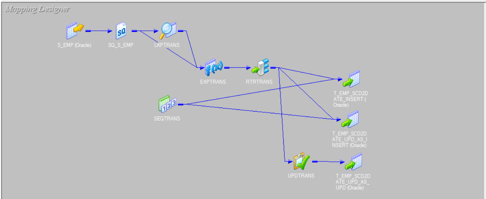
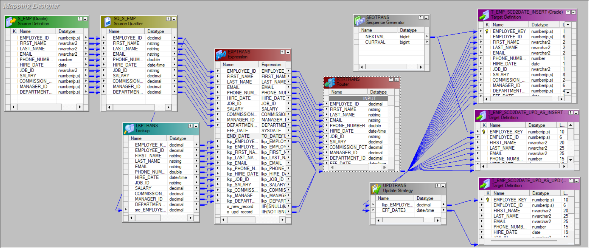
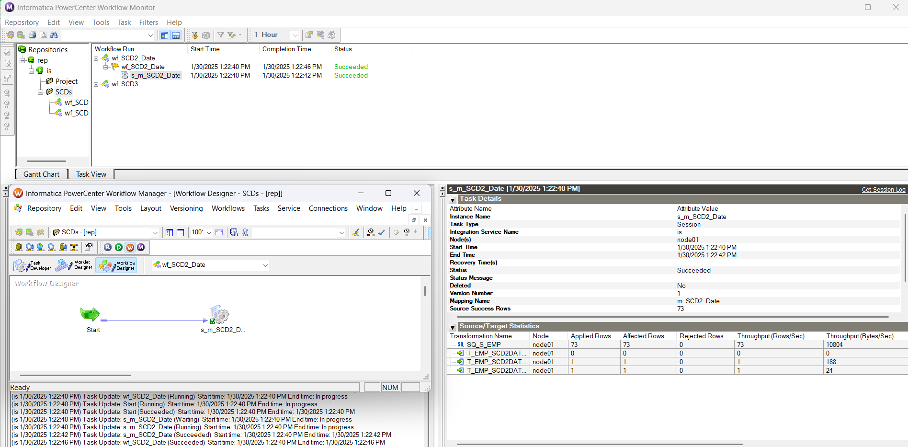
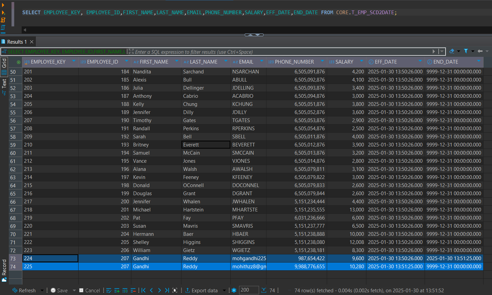

# Slowly Changing Dimensions (SCD) Implementation in Informatica PowerCenter

## 📌 Project Overview
This project demonstrates the implementation of all three types of Slowly Changing Dimensions (SCD) using Informatica PowerCenter. SCDs are used in data warehousing to manage and track changes in dimension tables over time.

## 🛠️ Implemented SCD Types
The project includes the following SCD types:

- **SCD Type 1 (Overwrite Changes)**: Updates records by overwriting old values.
- **SCD Type 2 (Track History)**: Maintains historical changes by adding new records with versioning or start/end date fields.
  - ***Date Method***    : Maintaining history using `effective_date` and `end_date` attributes.
  - ***Flag Method***    : Maintaining history using a `flag` attribute to differentiate active and inactive records.
  - ***Version Method*** : Maintaining history using a `version` attribute to track record versions.
- **SCD Type 3 (Limited History)**: Stores historical changes in separate columns within the same record.

## 🛠 Implementation Overview
The mappings use **various transformations** to implement Slowly Changing Dimensions:

- **Source Qualifier** to read source data.
- **Lookup on the target table** to identify active records.
- **Expression Transformation with MD5 function** to compare changes between source and target.
- **Router Transformation** to divert records for **Insert and Update** based on detected changes.
- **Update Strategy Transformation** to handle updates per SCD type (overwrite, add new version, or update existing fields).
- **Target Definition** to load final records into the data warehouse.

## 📸 Screenshots – SCD Type 2 (Date Method)

### **Mapping for SCD Type 2 (Date Method)**


  
🔹 *Compares source and target using MD5, identifies changes, and routes records for insert/update.*

### **Workflow Execution Screenshot**
  
🔹 *Shows successful execution of the workflow processing changes in dimension records.*

### **Target Table After Execution**
  
🔹 *Demonstrates historical tracking using Effective Date and End Date columns.*


## 📂 Project Structure
```
/scd-implementation-informatica
│── /mappings              # Informatica PowerCenter mappings for SCD types
│── /workflows             # Workflows created for executing mappings
│── /source_data           # Sample source data files
│── /target_data           # Expected target data files after SCD processing
│── /images                # Screenshots of mappings, workflows, and results
│── /sql_scripts           # SQL scripts for source and target table structures
│── README.md              # Documentation for the project
```

## ⚙️ Prerequisites
Before running the mappings, ensure you have:
- **Informatica PowerCenter installed** (minimum version 10.x recommended)
- **Access to a relational database** (Oracle, SQL Server, MySQL, etc.)
- **Source and target tables created** according to SCD specifications (Refer Tables Structure File)

## 🚀 Getting Started
1. **Clone the repository**
   ```bash
   git clone https://github.com/navDataEng/scd-implementation-informatica.git
   ```
2. **Import the mappings and workflows** into Informatica PowerCenter.
3. **Configure the source and target connections** based on your database.
4. **Run the workflows** to observe how different SCD types process data.

## 📷 Screenshots and Results
For detailed visual documentation, refer to the `/images` folder, where you will find:
- **Mappings for each SCD type**
- **Workflow execution screenshots**
- **Before and after target table data samples**

## 📊 Example Use Cases
- **Tracking customer profile changes over time**
- **Managing product price history**
- **Handling employee job title updates**
- **Maintaining product category changes over different periods**

## 🤝 Contributing
Feel free to fork this repository and enhance it with additional SCD variations, optimizations, or documentation.

## 📜 License
This project is licensed under the MIT License.

---
🔗 **Author**: Naveen Madala  
📧 **Contact**: madalanaveen9@gmail.com
🔗 **LinkedIn**: [naveen-madala9](https://www.linkedin.com/in/naveen-madala9/)
 
